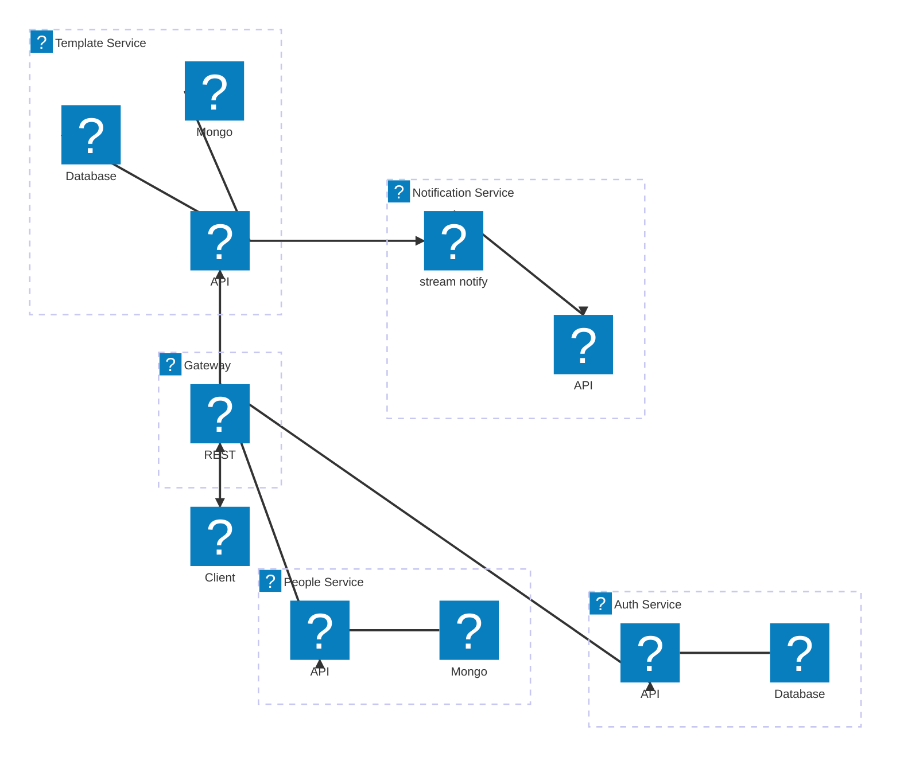

# Micro service diagram

```mermaid
architecture-beta
    group ingress(logos:aws-elb)[Gateway] 
    service gateway(mdi:proxy)[REST] in ingress

    service client(mdi:laptop)[Client]
    client:T <--> B:gateway 

    group svc_auth(mdi:kubernetes)[Auth Service] 
    group svc_people(mdi:kubernetes)[People Service]
    group svc_tmpl(mdi:kubernetes)[Template Service] 
    group svc_notify(mdi:kubernetes)[Notification Service] 

    service svc_auth_api(mdi:lambda)[API] in svc_auth
    service svc_auth_db(logos:aws-rds)[Database] in svc_auth
    svc_auth_api:B <-- T:gateway
    svc_auth_api:R -- L:svc_auth_db

    service svc_people_api(mdi:lambda)[API] in svc_people
    service svc_people_db(logos:aws-documentdb)[Mongo] in svc_people
    svc_people_api:B <-- T:gateway
    svc_people_api:R -- L:svc_people_db

    service svc_tmpl_api(mdi:lambda)[API] in svc_tmpl
    service svc_tmpl_db(logos:aws-documentdb)[Database] in svc_tmpl
    service svc_tmpl_s3(logos:aws-s3)[Mongo] in svc_tmpl
    svc_tmpl_api:B <-- T:gateway
    svc_tmpl_api:R -- L:svc_tmpl_s3
    svc_tmpl_api:R -- L:svc_tmpl_db
    svc_tmpl_api:R --> L:js_notify

    service svc_notify_api(logos:aws-ses)[API] in svc_notify
    service js_notify(logos:aws-sqs)[stream notify] in svc_notify
    svc_notify_api:T <-- T:js_notify

```
