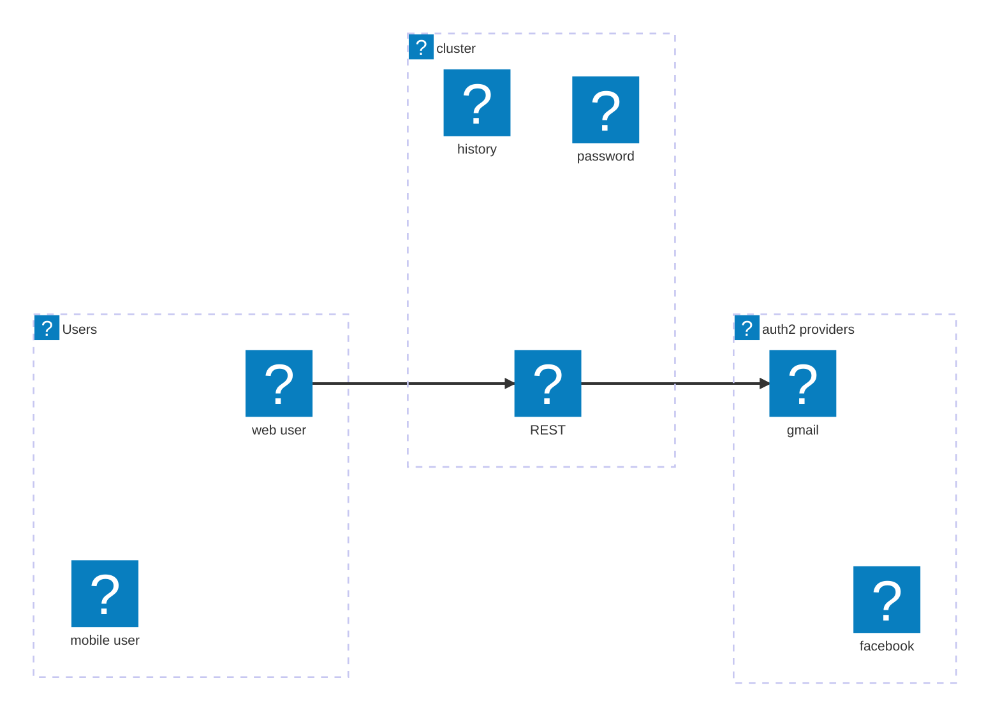

# Authentication service

## Diagram

```mermaid
architecture-beta
    group ingress(logos:aws-eks)[cluster]
    group external(mdi:cloud)[auth2 providers]
    group client(mdi:users)[Users]

    service gateway(mdi:proxy)[REST] in ingress
    service db(mdi:database)[password] in ingress
    service history(mdi:database)[history] in ingress
    service gmail(mdi:lock)[gmail] in external
    service facebook(mdi:lock)[facebook] in external

    service web_user(mdi:web)[web user] in client
    service mobileuser(mdi:smartphone)[mobile user] in client

    web_user:R --> L:gateway
    web_user:R --> L:gmail
    gateway:R --> L:gmail

```
