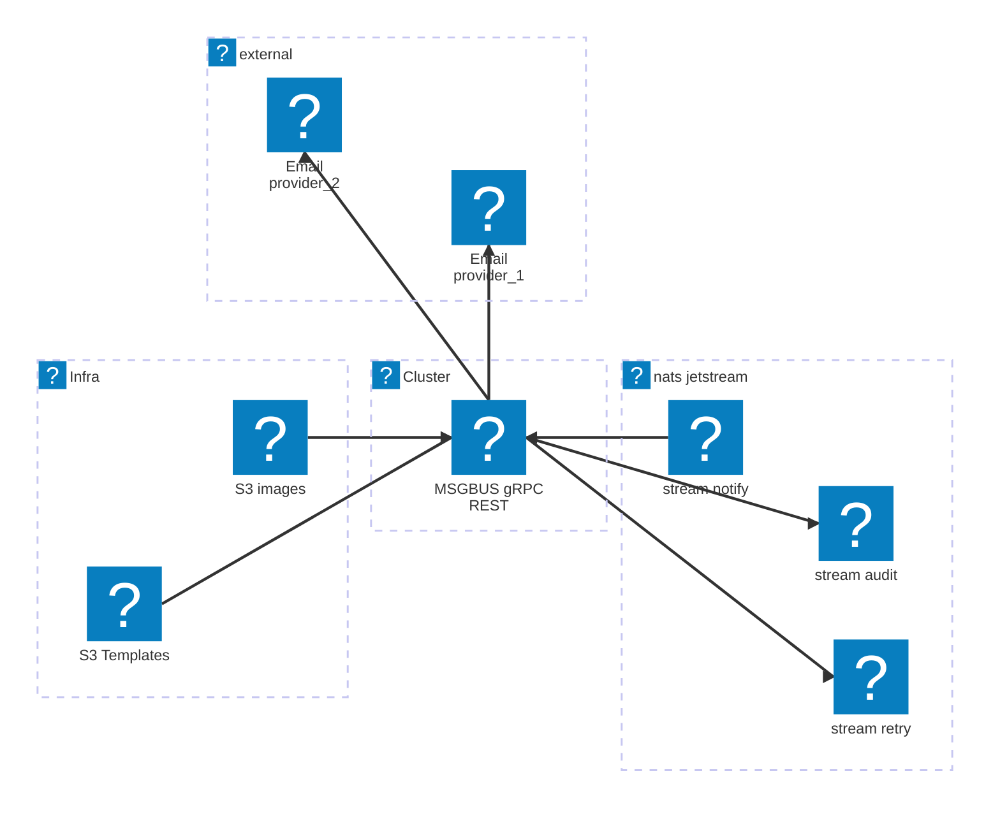

# Email Service Diagram

```mermaid

architecture-beta
    

    group external(mdi:cloud)[external]
    group k8s(mdi:kubernetes)[Cluster]
    group pubsub(mdi:apache-kafka)[nats jetstream]
    group infra(mdi:kubernetes)[Infra]

    service smtp(mdi:email)[Email provider_1] in external 
    service sms(mdi:email)[Email provider_2] in external

    service api(mdi:api)[MSGBUS gRPC REST] in k8s
    service bucket_tmpl(mdi:bucket)[S3 Templates] in infra
    service bucket_images(mdi:bucket)[S3 images] in infra
    service js_retry(mdi:queue)[stream retry] in pubsub
    service js_notify(mdi:queue)[stream notify] in pubsub
    service js_audit(mdi:queue)[stream audit] in pubsub

    api:L <-- R:bucket_tmpl
    api:L <-- R:bucket_images
    api:R --> L:js_retry
    api:R --> L:js_audit
    api:R <-- L:js_notify
    api:T --> B:sms
    api:T --> B:smtp

```
