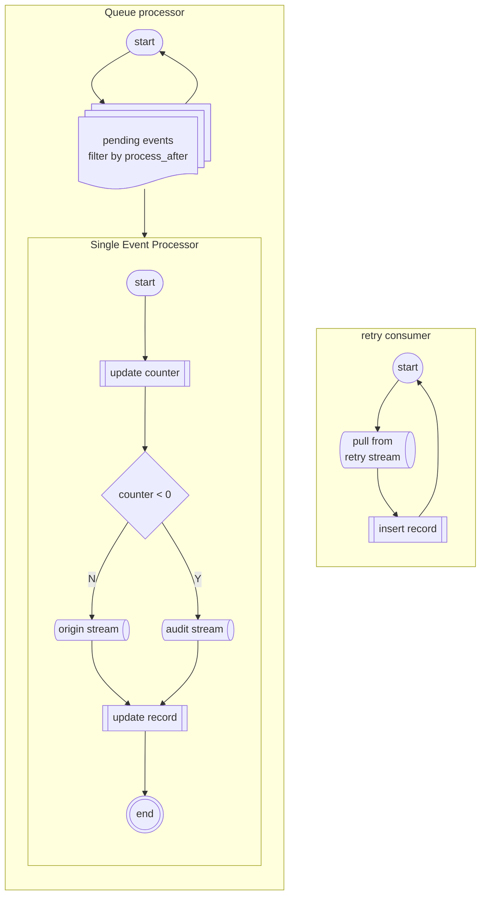
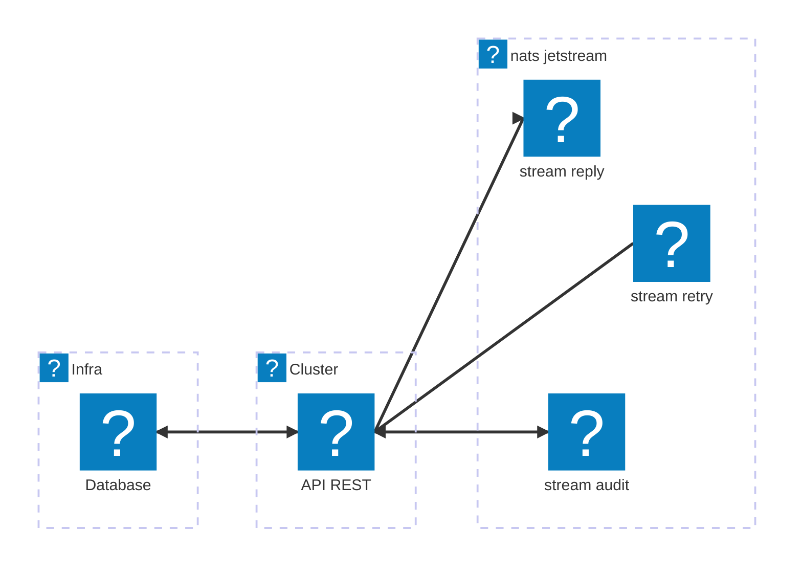

# Retry Service Diagram

## API Flow chart

```mermaid
flowchart TB
    subgraph retry_routine [retry consumer]
        direction TB
        retry_start((start)) --> sub_retry@{ shape: das, label: "pull from\nretry stream" }
        sub_retry --> insert_event[[insert record]]
        insert_event --> retry_start
    end

    subgraph Queue processor
        direction TB 
        main_loop([start]) --> fetcher@{ shape: docs, label: "pending events\nfilter by process_after" }
        fetcher --> event_pro
        fetcher --> main_loop
    end
    subgraph event_pro [Single Event Processor]
        direction TB
        start_event_processor([start]) --> update_counter[[update counter]]
        update_counter --> if_counter{counter < 0}
        if_counter --> |N| push_reply@{ shape: das, label: "origin stream" }
        if_counter --> |Y| push_audit@{ shape: das, label: "audit stream" }
        push_reply --> update_event
        push_audit --> update_event
        update_event[[update record]] --> end_event_processor(((end)))
    end

```

## Service chart

```mermaid


architecture-beta
    group k8s(mdi:kubernetes)[Cluster]
    group pubsub(mdi:apache-kafka)[nats jetstream]
    group infra(mdi:kubernetes)[Infra]
    
    service api(mdi:api)[API REST] in k8s
    service db(mdi:database)[Database] in infra
    service js_retry(mdi:queue)[stream retry] in pubsub
    service js_reply(mdi:queue)[stream reply] in pubsub
    service js_audit(mdi:queue)[stream audit] in pubsub


    api:L <--> R:db
    api:R <-- L:js_retry
    api:R --> L:js_reply
    api:R --> L:js_audit

```
