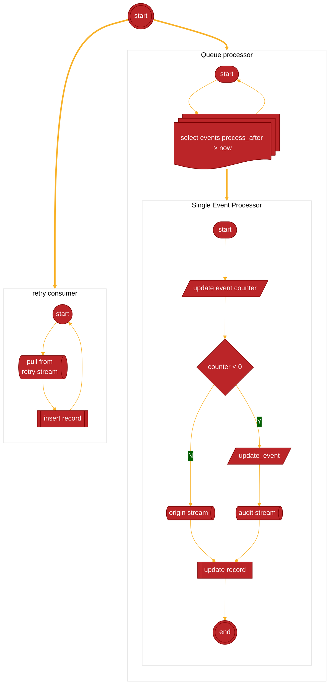
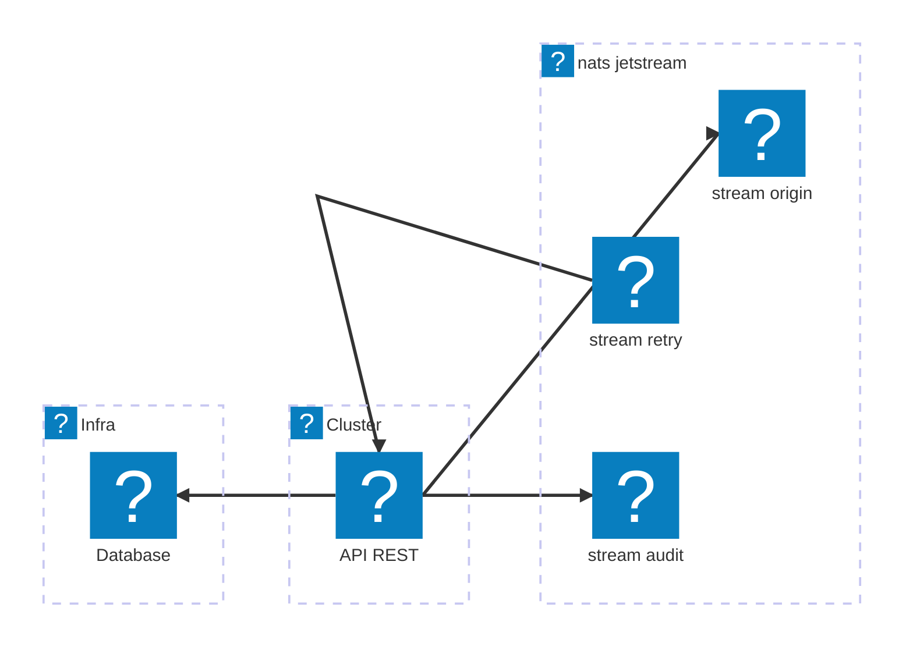

# Retry Service Diagram

## API Flow chart

<!-- Initialize with any icon  -->

```mermaid

%%{
    init: {
        'theme':'base',
        'themeVariables': {
            'primaryColor': '#BB2528',
            'primaryTextColor': '#fff',
            'primaryBorderColor': '#7C0000',
            'lineColor': '#F8B229',
            'secondaryColor': '#006100',
            'tertiaryColor': '#fff'
        }
    }
}%%

flowchart TB
    proc_loop(((start)))
    proc_loop ==> retry_routine
    proc_loop ==> queue_processor

    subgraph retry_routine [retry consumer]
        direction TB
        retry_start((start)) --> sub_retry@{ shape: das, label: "pull from\nretry stream" }
        sub_retry --> insert_event[[insert record]]
        insert_event --> retry_start
    end

    subgraph queue_processor [Queue processor]
        direction TB
        main_loop([start]) --> fetcher@{ shape: docs, label: "select events process_after > now" }
        fetcher ==> event_pro
        fetcher --> main_loop
    end
    subgraph event_pro [Single Event Processor]
        direction TB
        start_event_processor([start]) --> update_counter[/update event counter/]
        update_counter --> if_counter{counter < 0}
        if_counter --> |N| push_reply@{ shape: das, label: "origin stream" }
        if_counter --> |Y| asd[/update_event/] --> push_audit@{ shape: das, label: "audit stream" }
        push_reply --> update_event
        push_audit --> update_event
        update_event[[update record]] --> end_event_processor(((end)))
    end

```

## Service chart

```mermaid

architecture-beta
    group k8s(mdi:kubernetes)[Cluster]
    group pubsub(mdi:apache-kafka)[nats jetstream]
    group infra(mdi:kubernetes)[Infra]
    
    service api(mdi:api)[API REST] in k8s
    service db(mdi:database)[Database] in infra
    service js_retry(mdi:queue)[stream retry] in pubsub
    service js_reply(mdi:queue)[stream origin] in pubsub
    service js_audit(mdi:queue)[stream audit] in pubsub


    api:L --> R:db
    api:T <-- L:js_retry
    api:R --> L:js_reply
    api:R --> L:js_audit

```
