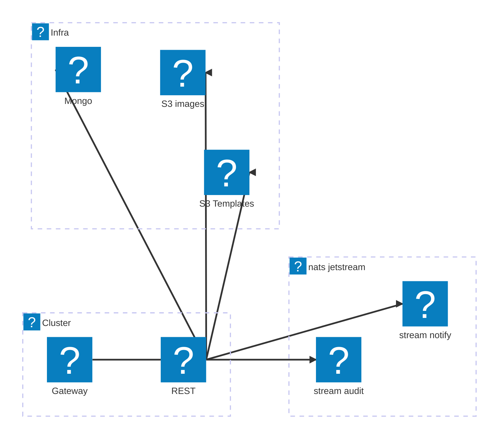

# Service Diagram

```mermaid
architecture-beta
    group k8s(mdi:kubernetes)[Cluster]
    group pubsub(mdi:apache-kafka)[nats jetstream]
    group infra(mdi:kubernetes)[Infra]
    
    service gateway(mdi:proxy)[Gateway] in k8s
    service api(mdi:api)[REST] in k8s
    service bucket_tmpl(mdi:bucket)[S3 Templates] in infra
    service bucket_images(mdi:bucket)[S3 images] in infra
    service mongo(mdi:json)[Mongo] in infra
    service js_notify(mdi:queue)[stream notify] in pubsub
    service js_audit(mdi:queue)[stream audit] in pubsub

    gateway:R -- L:api
    api:R -- L:mongo
    api:R --> R:bucket_tmpl
    api:R --> R:bucket_images
    api:R --> L:js_notify
    api:R --> L:js_audit

```
